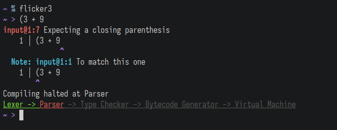

## July 7, 2025

This was when I decided Flicker's compiler needed a rewrite and feature overhaul.
I began to plan what my end goal would be.

## July – November 2025

I'd decided that although C is nice, I didn't want to use it for Flicker 3.
So I learned C++, using the wonderful tutorials on [learncpp].
My plan was to finish before the beginning of December so I could do the Advent of Code in C++ then begin working on Flicker in the spring.

## December 2025

I was not done with the [learncpp] tutorials. But I knew enough to do Advent of Code anyway.
Because there were only 12 days of AoC, I had more time at the end of the month.
I did the occasional C++ lesson, but still made little progress.

## January 27, 2026

It was a snowy day. I was bored. And what better to do when you're bored than start writing tests for a language you're designing?

I got CMake hooked up with Google Test, ready to get going. There wasn't much to test, so it wasn't as satsifying as actual language design.
But testing is important.

## January 28 – 30, 2026

Lexers. Aren't they beautiful? They're also really fun to write.
In my case, it was more rewriting than writing, because Flicker 2 had a very functional lexer that translated easily from C to C++.

Well, that was my expectation, and it was mostly true,
but I did notice the occasional bug in the old code that should've _completely prevented Flicker 2 from working_.
Needless to say, those bugs did not get ported to F3.

I was unfamiliar with GTest and not quite bored enough to go in-depth learning it, so I asked Claude (the LLM) to create a little example test that I could
examine to familiarize myself with the framework.
It wrote an entire test suite for my lexer. The tests were not rigorous—they didn't cover any of the
edge cases I needed to look out for—but there were at about 120 of them.

## January 31, 2026

I was curious how parsers worked. I tried to learn what the different varieties were, but didn't come away with much.
It seemed like a recursive descent parser (the same type Flicker 2 had) was a good idea for F3 as well,
mainly for quality (helpfulness) of error messages. That's a priority for me.

I needed a good language grammar to write a consistent recursive descent parser with a clear structure. I used the one I'd started writing for the Flicker
IntelliJ Plugin (forgot to mention that short-lived project). I wanted to test Junie, the JetBrains AI agent, so I asked it to write a lexer adapter to turn
my handwritten lexer's tokens into ones ANTLR 4 could read. It did pretty well, and by the end of the day I could write Flicker code in a file and have the
computer lex and parse it.

Note that ANTLR is only temporary. It (and all the AI-written code accompanying it) will be permanently removed once my grammar is stable.

----

## February 3, 2026

The day I created this log file. You can see I've switched to present tense.

For the past couple of days, I've been modifying Flicker's grammar. Today I wrote the outline for classes.
I still haven't finished the [learncpp] tutorials, by the way.

## February 9, 2026

The repository is now public, licensed under the MPL 2.0.
I've done two main things since the last entry:

* Lots of tokens have been shuffled around, and I've added new helpful ones like `?:` (Elvis or Nil Coalescing Operator), `++`, `--`, and all the modifying
  assignment operators (`+=`, `/=`, `^=`, and the rest).

* Error recovery in the lexer. Now, instead of stopping at the first error, it will print a list of all that it finds. It won't continue to parse after
  finding a lexer error, so I don't need too sophisticated error recovery, but I do still need to consume the right number of characters to continue lexing
  after an error.

`CMakePresets.json` now stores two presets: debug and release. A build guide is in the README.

## February 18, 2026

After not working on this project for a long time, I realized I'd forgotten about initializers in the grammar. Now that's fixed.

## February 22 and 23, 2026

I've shifted the data structure of things around; now, instead of storing lines and columns for tokens, errors, lexer state, everything is now done in
"offsets": absolute character positions within the source string. The lexer keeps track of the offset of the start of each line, allowing me to compute line
and column without difficulty, but only when they're necessary (in case of an error).

Errors can now have "contexts" attached to them, which show an additional note when needed (exactly like most C/C++ compilers). In fact, errors are just nicer
in general. They went from this:

```
/test/lexer/numbers.fl@107:6 Unexpected character
 | bx + $3
 |      ^
```

to this:

```
numbers@107:6 Unexpected character
  107 │ bx + $3
             ^
```

And, of course, the module name and position are bold and colored.

## March 10, 2026

I'm very aware that I should get the lexer to a point where I'm satisfied with it, then start a parser (or bytecode VM, depending on what I feel like doing
next). Because of this, `parser.h` now exists, containing a wrapper around my ANTLR4 parser.

A block comment issue has been sorted out now—they can return newlines if they actually cross a newline; double comments (`##`) are the way to override/escape
newlines.

## March 13 – 16, 2026

For the lexer to be considered complete, it needs to stand up to some rigorous testing. I've rewritten the whole lexer test file.

## March 17 – 18, 2026

And yes, I was correct a week ago that I should start working on something new. That is why I now have a few very simple AST node classes: Binary, Unary,
Grouping, and Literal, based on [someone else's implementation of JLox in C++](https://github.com/the-lambda-way/CppLox) (thanks, the-lambda-way!).

After a couple of days of work, I have a Pratt parser—for very basic expressions only—that works as expected! If only I had a way to print its output.

## March 19, 2026

Parser errors can now be printed, just like lexer ones (really, it's the same function). I've been working next on printing DOT output to make a graph of the
parse tree. It should, in theory, be easier than it was with ANTLR, and that's saying a lot, considering I didn't write any code myself for that. I've gotten
experience creating `ExprVisitor`s to play around with the tree now—the visitor pattern is pretty nice. The problem I've faced is that an `ExprVisitor`'s accept
methods must return `std::any`, which allows me to write some pretty atrocious code and not realize. Luckily, there happens to be a way to build a wrapper class
around a templated `ExprVisitor<R>` to force all methods to return `R`.

With that annoyance out of the way, I have both good-looking code _and_ a graphical parse tree printer.

## March 20, 2026

I've done three things:

1. Avoided populating every folder I run `flicker3` in with a `tree.dot` file; it's exported to an absolute path now.
2. Fixed broken logic in `Parser::expect()` which broke parentheses, and would've broken much more if I had anything more for it to break.
3. Made an honestly pretty pointless progress tracker (oh, and by the way, colors are now RGB instead of from the 256 options).



## March 22, 2026

The lexer parser numbers now. I'm now fully satisfied with it. I don't know if I'll ever say the same about the parser, VM, or anything...

Oh, wait. The lexer has too many keywords. Sometime I'll need to turn some of those reserved words into soft keywords. Nothing's perfect after all.

And, what's more, the log is now up to date. I am actually writing this on the day it is listed as, unlike the past 5 entries.

## March 24 – 25, 2026

Moving closer to what operators will be like in the future, I've now added function names to the parse rule table (like `+` and `not_in`). The AST stores the
name of this function so it can be resolved then called. There are still some iffy things about this—plot holes, you could say—but it makes the DOT printing in
`util.cpp` much easier.

And, because it has more benefits than drawbacks, `print` is now an expression. `error` is too.

The file `ast.h` is now generated by a Python script. It has statement support as well! That means next time I get a chance to work on this, Flicker programs
will actually be a list of statements instead of a single expression. It may be worth noting that all statements can do right now is serve as a wrapper around
an expression.

## March 26, 2026

And just like predicted, statements are now working beautifully. There are pass statements, if statements, while statements, block statements (a wrapper around
_more_ statements), and the fallback: expression statements.

It's hard to convey how easy it is to add a new AST node type—_and parse it._ Flicker 3 is coming along really nicely. The parser isn't going to be overwhelmed
by the duties of resolving identifiers, storing locals, and all that stuff (that's the typechecker's job), so I may be able to focus more on error messages in
the parser.

Speaking of error messages, I haven't even started on error recovery yet.

## April 2, 2026

Statement parsing!

I've taken out `when` statements; they don't feel like idiomatic Flicker, and I'm too lazy to implement parsing for them. No, in reality,
they're really not worth it if all they do is create an if-elif-elif-elif-else AST internally. If they're something special (jump tables), they should have
special syntax, but syntactic sugar is misleading.

Something like this will parse now:

```
each item[index] in list
  print "item " + index + " is " + item

for:label ;;
  break:label
```

## April 4, 2026

And now work has begun on declarations. Types are parsed (as completely as they should ever be unless I add algebraic types—see the first snippet below).
Variable declarations are also implemented, at least as far as the the parser will see them go.

I'm pleasantly surprised by the amount of work I get to put off to the analyzer pass. In Flicker 2, the parser took almost the entire burden of syntactic and
semantic analysis. In Flicker 3, it is pretty much solely syntactic (I have yet to find a counterpoint).

But yes, now I'm dreading writing an analyzer.

```
String
String?
List of String   # There is a list with strings
List? of String  # If there is a list, it has non-optional strings
List of String?  # There is a list, but it has optional strings
List? of String? # There may be a list, and it may have strings or Nil
Pair of Int, Int
```
```
var a: Int?
val b: Banana    # Errors because vals need an initializer
val c = 32
```

## April 7 – ongoing, 2026

The next step, in my opinion, is to take care of the rest of the expressions instead of jumping fully into statements—because classes and functions are going to be hard.

Day 1: `++`, `--`, and if expressions (`... if ... else ...`)

[learncpp]: https://learncpp.com

[thing]: https://github.com/